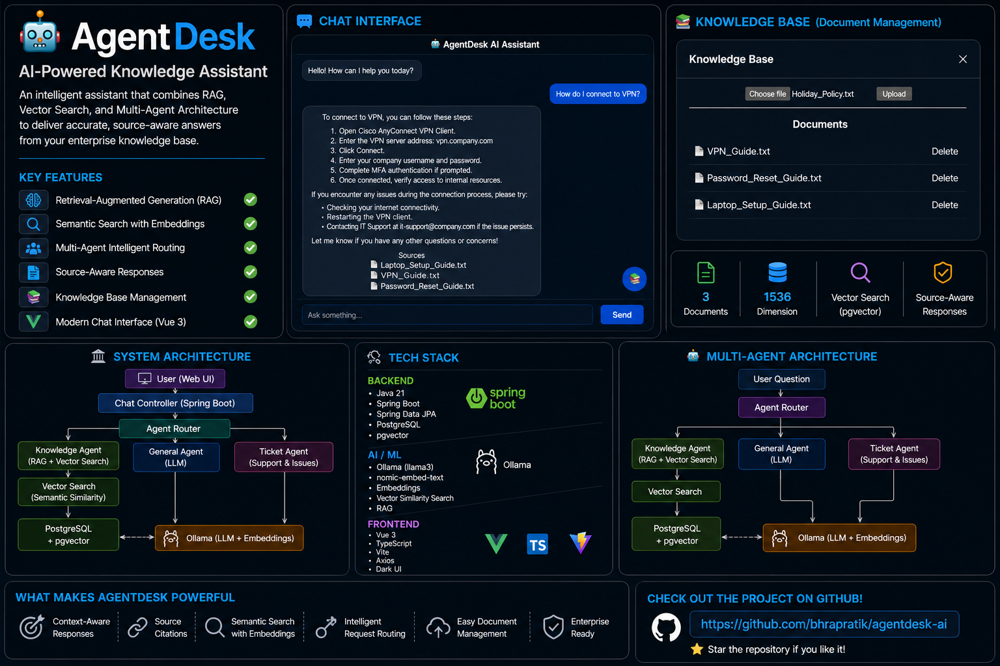
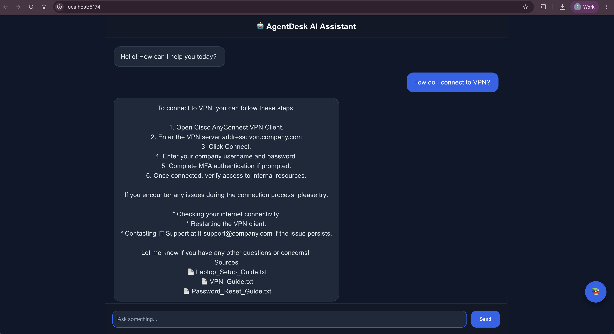
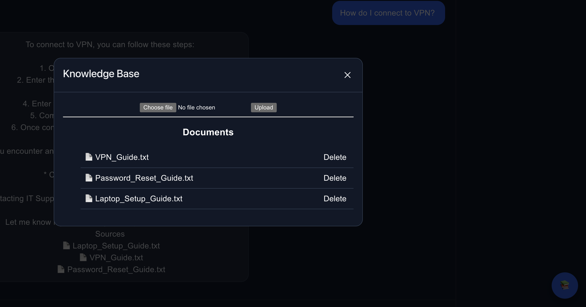
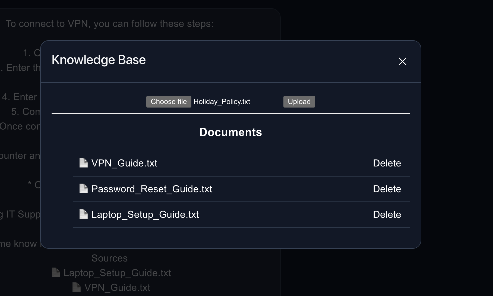

# AgentDesk 🚀

AI-Powered Knowledge Assistant built with Spring Boot, PostgreSQL/pgvector, Ollama, and Vue.js.

AgentDesk demonstrates how Retrieval-Augmented Generation (RAG), vector search, embeddings, and intelligent agent routing can be combined to build an enterprise knowledge assistant capable of answering questions using organizational documents.

---

# Screenshot



---

# Features

## AI & RAG

* Retrieval-Augmented Generation (RAG)
* Semantic Search using Embeddings
* Vector Similarity Search with pgvector
* Context-Aware Responses
* Source-Aware Responses
* Enterprise Knowledge Retrieval

## Multi-Agent Architecture

* Knowledge Agent
* General Agent
* Ticket Agent
* Intelligent Request Routing
* LLM Fallback Handling

## Knowledge Management

* Upload Documents
* Generate Embeddings
* Store Vectors in PostgreSQL
* Semantic Retrieval
* Delete Documents
* Knowledge Base Administration

## Frontend

* Modern Vue 3 Chat Interface
* Dark Theme UI
* Responsive Design
* Source Citations
* Document Management Modal

---

# Screenshots

## Chat Interface

Ask questions against the knowledge base and receive AI-generated responses powered by Retrieval-Augmented Generation (RAG).



---

## Source Citations

AgentDesk displays the documents used to generate responses, providing transparency and traceability.


---

## Knowledge Management

Browse and manage uploaded documents directly from the UI.



---

## Document Upload

Upload documents for embedding generation, indexing, and semantic retrieval.



---

# Architecture

```text
                    ┌─────────────────┐
                    │   Vue Frontend  │
                    └────────┬────────┘
                             │
                             ▼
                    ┌─────────────────┐
                    │  ChatController │
                    └────────┬────────┘
                             │
                             ▼
                    ┌─────────────────┐
                    │   ChatService   │
                    └────────┬────────┘
                             │
                             ▼
                    ┌─────────────────┐
                    │  Agent Router   │
                    └───────┬─────────┘
                            │
          ┌─────────────────┼─────────────────┐
          ▼                 ▼                 ▼

 ┌────────────────┐ ┌──────────────┐ ┌────────────────┐
 │ KnowledgeAgent │ │ GeneralAgent │ │  TicketAgent   │
 └───────┬────────┘ └──────────────┘ └────────────────┘
         │
         ▼

 ┌──────────────────────┐
 │   Vector Search      │
 └──────────┬───────────┘
            │
            ▼

 ┌──────────────────────┐
 │ PostgreSQL + pgvector│
 └──────────┬───────────┘
            │
            ▼

 ┌──────────────────────┐
 │      Ollama          │
 │ LLM + Embeddings     │
 └──────────────────────┘
```

---

# Agent Architecture

AgentDesk uses a multi-agent architecture to intelligently route requests.

## Knowledge Agent

Responsible for Retrieval-Augmented Generation (RAG).

### Workflow

```text
User Question
      ↓
Generate Embedding
      ↓
Vector Search
      ↓
Retrieve Relevant Documents
      ↓
Generate Context-Aware Response
      ↓
Return Sources
```

### Examples

* How do I connect to VPN?
* How do I reset my password?
* What is the company holiday policy?
* Show me laptop setup instructions.

---

## General Agent

Responsible for general-purpose AI conversations that do not require enterprise knowledge retrieval.

### Workflow

```text
User Question
      ↓
LLM
      ↓
Response
```

### Examples

* What is the capital of France?
* Explain Dependency Injection in Spring Boot.
* What is Retrieval-Augmented Generation?
* Explain Vector Databases.

---

## Ticket Agent

Responsible for support and issue-management workflows.

### Examples

* Create a VPN support ticket.
* Report a laptop issue.
* Open an IT incident.

---

## Intelligent Routing

```text
Question
    ↓
Agent Router
    ↓

 ┌───────────────┐
 │ Ticket Agent  │
 └───────────────┘

 ┌───────────────┐
 │KnowledgeAgent │
 └───────────────┘

 ┌───────────────┐
 │ GeneralAgent  │
 └───────────────┘
```

Knowledge-related requests leverage semantic search and vector retrieval, while general questions are answered directly by the LLM.

---

# Tech Stack

## Backend

* Java 21
* Spring Boot
* Spring Data JPA
* PostgreSQL
* pgvector
* Lombok
* Maven

## AI

* Ollama
* llama3
* nomic-embed-text
* Embeddings
* Semantic Search
* Vector Similarity Search
* Retrieval-Augmented Generation (RAG)

## Frontend

* Vue 3
* TypeScript
* Vite
* Axios

---

# Project Structure

```text
agentdesk
│
├── backend
│   ├── agent
│   ├── chat
│   ├── knowledge
│   ├── vector
│   ├── config
│   └── user
│
├── frontend
│   ├── components
│   ├── services
│   ├── assets
│   └── App.vue
│
└── docs
    └── screenshots
```

---

# Running Locally

## Prerequisites

* Java 21
* Maven
* Node.js 20+
* PostgreSQL
* Ollama

---

## PostgreSQL Setup

Enable pgvector:

```sql
CREATE EXTENSION IF NOT EXISTS vector;
```

Create database:

```sql
CREATE DATABASE agentdesk;
```

---

## Ollama Setup

Start Ollama:

```bash
ollama serve
```

Pull models:

```bash
ollama pull llama3
ollama pull nomic-embed-text
```

---

## Backend

```bash
cd backend
mvn spring-boot:run
```

Application:

```text
http://localhost:8080
```

---

## Frontend

```bash
cd frontend
npm install
npm run dev
```

Application:

```text
http://localhost:5173
```

---

# API Examples

## Chat

### Request

```http
POST /api/chat
```

```json
{
  "message": "How do I connect to VPN?"
}
```

### Response

```json
{
  "response": "Open Cisco AnyConnect and connect to vpn.company.com...",
  "sessionId": 61,
  "sources": [
    "VPN_Guide.txt"
  ]
}
```

---

## Upload Knowledge Document

```http
POST /api/knowledge/upload
```

---

## List Knowledge Documents

```http
GET /api/knowledge
```

---

## Delete Knowledge Document

```http
DELETE /api/knowledge/{id}
```

---

# Learning Objectives

This project was built to gain practical experience with:

* Retrieval-Augmented Generation (RAG)
* Embeddings
* Vector Databases
* PostgreSQL pgvector
* Semantic Search
* AI Agent Architectures
* Spring Boot Backend Development
* Vue.js Frontend Development
* End-to-End AI Application Development

---

# Future Improvements

* Document Chunking
* LangGraph Workflows
* Langfuse Observability
* Promptfoo Evaluation
* Streaming AI Responses
* Authentication & Authorization
* Docker Deployment
* Multi-User Support
* Monitoring & Analytics

---

# Author

**Pratik Behera**

Senior Android Developer | Spring Boot | PostgreSQL | AI Applications | RAG | Vector Search
